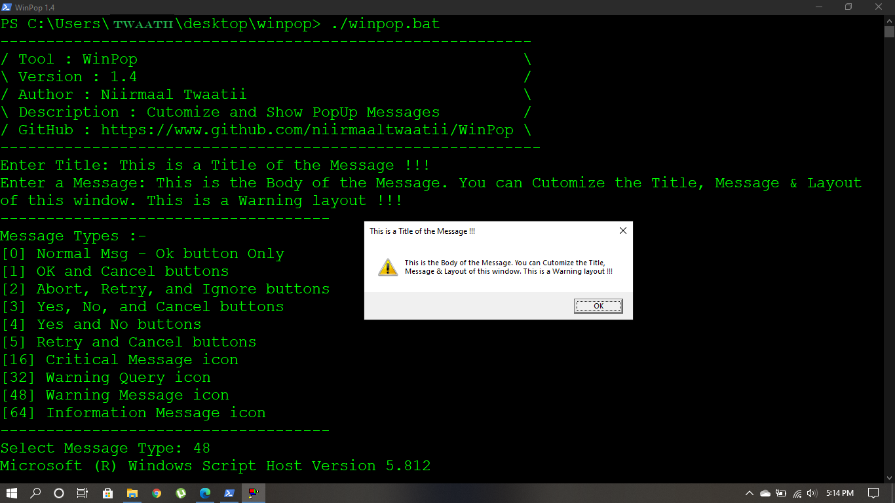

# WinPop
Windows Program to show Customizable PopUp Window Messages

---
# Installation & SetUp
_Install Git for Windows_ <br/>
**Open CMD & use following commands :-** <br/>

```
$ git clone https://www.github.com/niirmaaltwaatii/WinPop.git
```
<br/>

```
$ cd WinPop
```
<br/>

```
$ WinPop.bat OR WinPop32.exe | WinPop64.exe
```
<br/>
OR <br/>
Download the Compressed File & Extract Then Run the Batch file Or exe file <br/>

---

## Screenshot


## Errors
Runtime error from WinPop 1.3 is solved in WinPop 1.4
